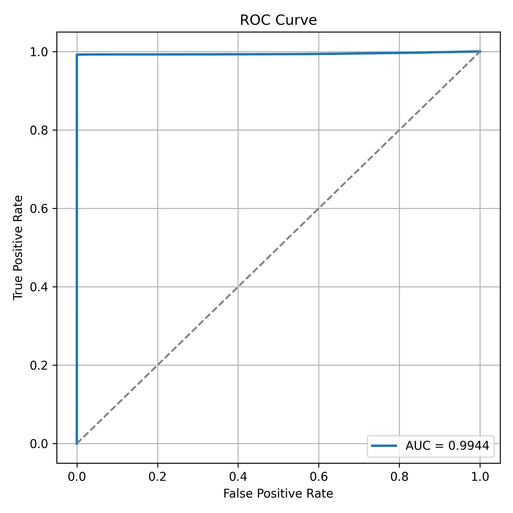
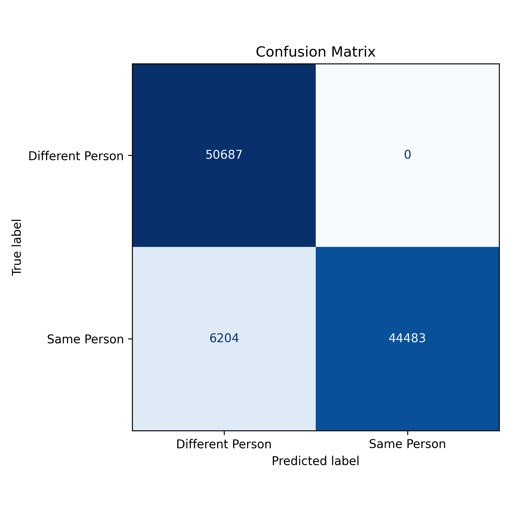
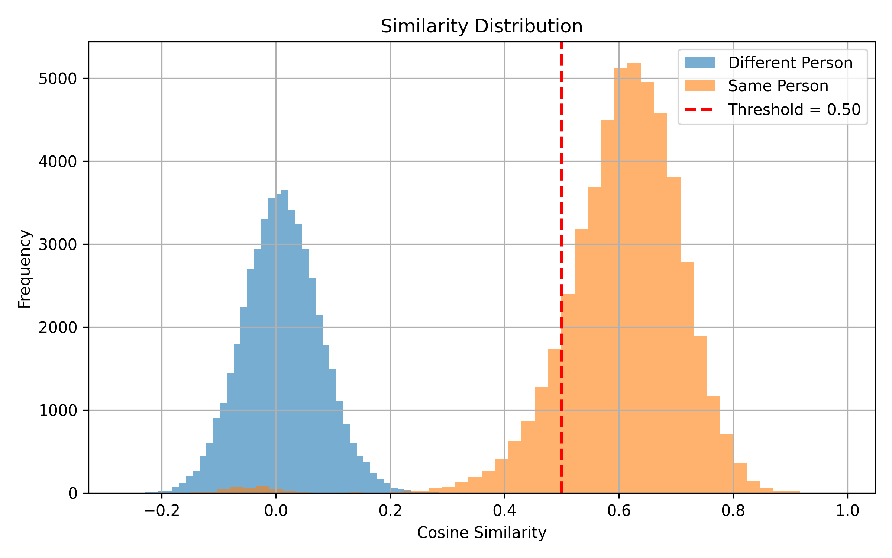

# 🔐 SecureFace AI

A real-time **Face Authentication System** built using **Flask**, **MediaPipe**, **InsightFace (ArcFace)**, and **MongoDB**. SecureFace AI authenticates users using both traditional credentials and biometric facial recognition for enhanced security.

---

## 🚀 Live Demo

**SecureFace AI (Live Demo):** 👉 https://secure-face-ai.onrender.com

> **⚠️ Note (Render Free Tier)**
>
> This application is deployed on **Render Free Tier**. Free instances automatically spin down after periods of inactivity and have limited CPU/memory resources. As a result:
> - The **first request may take 30–60 seconds** while the server wakes up.
> - During heavy usage (especially webcam-based registration and authentication), the service may become slow or temporarily restart.
> - If the live demo is unavailable, wait a moment and refresh, or refer to the screenshots and demo video below.
>
> The application runs reliably in a local environment, where these hosting limitations do not apply.

---

## 📌 Features

- 👤 User Registration
- 🔑 Secure Login using Face + Password
- 📷 Real-Time Webcam Face Capture
- 😊 Face Detection using MediaPipe
- 🧠 Face Recognition using InsightFace (ArcFace)
- 📐 512-D Face Embeddings
- 📊 Cosine Similarity & Euclidean Distance Matching
- 🔒 Password Hashing (Werkzeug - Scrypt)
- 💾 MongoDB Database Integration
- 🆔 Automatic User ID Generation
- ⏳ Session-based Authentication (2 Days)
- 📱 Responsive User Interface
- 🧪 Face Similarity Testing Module

---

## 📷 Application Preview

> Replace the placeholders below with your screenshots after uploading them to the repository.

| Page | Preview |
|------|---------|
| Landing Page |  |
| User Registration |  |
| Face Capture |  |
| Login |  |
| Dashboard |  |

### 🎥 Demo Videos / GIFs

> Replace these placeholders after uploading your GIF or recording.

- **Registration Workflow:**  — or 🎥 *(Add YouTube / Google Drive link here)*
- **Login & Face Authentication:**  — or 🎥 *(Add YouTube / Google Drive link here)*
- **Complete Project Walkthrough:** 🎬 *(Add YouTube link here, e.g. https://youtube.com/your-demo-video)*

---

## 🖥 Demo Walkthrough

**Landing Page**
- Project Introduction
- Features Overview
- Login/Register Navigation

**Registration**
- User Details
- Live Face Capture
- Face Embedding Generation
- Secure Password Storage

**Login**
- User ID Verification
- Email Verification
- Password Verification
- Live Face Verification
- Dashboard Access

**Dashboard**
- User Profile
- Project Information
- Authentication Status
- Technology Stack

---

## 🏗 Project Architecture

```
SecureFace AI
│
├── app
│   │
│   ├── api
│   │   ├── detect.py
│   │   ├── register.py
│   │   ├── login.py
│   │   └── dashboard.py
│   │
│   ├── core
│   │   ├── face_detector.py
│   │   ├── get_embedings.py
│   │   ├── check_similarity.py
│   │   └── anti_spoof.py (Future)
│   │
│   ├── db
│   │   ├── mongodb.py
│   │   └── user_repo.py
│   │
│   └── __init__.py
│
├── image
├── static
├── templates
├── test
│
├── .env
├── requirements.txt
├── run.py
└── README.md
```

---

## ⚙️ Technology Stack

| Category | Technologies |
|---|---|
| **Backend** | Python, Flask, REST API |
| **Frontend** | HTML5, CSS3, JavaScript, Fetch API |
| **Computer Vision** | OpenCV, MediaPipe |
| **Face Recognition** | InsightFace, ArcFace (buffalo_sc) |
| **Machine Learning** | NumPy |
| **Database** | MongoDB Atlas |
| **Security** | Werkzeug Security (Scrypt), Flask Sessions, Environment Variables |

---

## 🧠 AI Pipeline

### Registration Flow
```
User → Capture Face → MediaPipe Face Detection → Face Crop
     → InsightFace Embedding → Generate User ID → Hash Password
     → Store User Data → MongoDB
```

### Login Flow
```
User → Capture Live Face → MediaPipe Detection → Generate Face Embedding
     → Verify Email → Verify User ID → Verify Password
     → Compare Face Embeddings → Authentication Success → Dashboard
```

### Face Recognition Pipeline
```
Input Image → MediaPipe Face Detection → Face Crop
            → InsightFace ArcFace → 512-D Face Embedding
            → Cosine Similarity → Euclidean Distance
            → Authentication Result
```

---

## 📊 Face Matching

The system compares two facial embeddings using:
- Cosine Similarity
- Euclidean Distance

Authentication succeeds only if **both** similarity metrics satisfy predefined thresholds.

---

## 🔒 Security Features

- Password Hashing using Scrypt
- Session Authentication
- Environment Variables
- Face Authentication
- User ID Validation
- Email Validation

---

## 📂 Database Schema

Each registered user record contains:

| Field | Description |
|--------|-------------|
| User ID | Unique Generated ID |
| Name | User Name |
| Email | User Email |
| Password | Hashed Password |
| Face Embedding | 512-D Vector |
| Created At | Registration Date |

---

## 🧪 Testing

**Face Detection**
- Detect face successfully
- Face crop validation

**Face Embedding**
- Generate 512-dimensional embeddings

**Similarity Testing**
- Same Person Matching
- Different Person Matching
- Outputs: Cosine Similarity, Euclidean Distance, Match Decision

Results are stored in `similarity_results.csv`.

---

## 📊 Performance Evaluation

SecureFace AI was evaluated on publicly available benchmark datasets to measure face detection and face verification performance.

### 📌 Evaluation Datasets

| Dataset | Purpose | Images / Pairs |
|---------|---------|---------------:|
| CelebA | Face Detection & Authentication Validation | 10,000 Images |
| LFW (Labeled Faces in the Wild) | Face Verification | 101,374 Verification Pairs |

### 😊 Face Detection Evaluation (CelebA)

| Metric | Result |
|---------|-------:|
| Images Evaluated | 10,000 |
| Face Detected | 9,997 (99.97%) |
| Single Face Validation | 9,946 (99.46%) |
| Authentication Passed | 5,312 (53.12%) |
| Average Detection Time | 90.87 ms |
| Processing Speed | 11 FPS |

**Why is the Authentication Pass Rate Lower?**

SecureFace AI is designed for **secure biometric authentication**, not general face detection. Authentication succeeds only when:
- Exactly one face is present
- The face is clearly visible
- The user is looking directly at the camera
- Proper frontal facial alignment is detected

Side-view and profile images in the CelebA dataset are therefore intentionally rejected to improve real-world authentication security.

### 🔐 Face Verification Evaluation (LFW)

- Generated face embeddings using InsightFace ArcFace (buffalo_sc)
- Created **101,374 verification pairs**
- Optimized similarity thresholds via exhaustive threshold search (230+ combinations)

**Optimized Thresholds**

| Metric | Value |
|--------|------:|
| Cosine Similarity | ≥ 0.50 |
| Euclidean Distance | ≤ 1.00 |

**Verification Results**

| Metric | Value |
|---------|-------:|
| Verification Accuracy | **93.88%** |
| Precision | **100.00%** |
| Recall | **87.76%** |
| F1 Score | **93.48%** |
| ROC-AUC | **0.9944** |
| False Acceptance Rate (FAR) | **0.00%** |
| False Rejection Rate (FRR) | **12.24%** |

**Confusion Matrix**

| | Predicted Different | Predicted Same |
|---|---:|---:|
| **Actual Different** | 50,687 | 0 |
| **Actual Same** | 6,204 | 44,483 |

**Evaluation Graphs**

| ROC Curve | Confusion Matrix | Similarity Distribution |
|---|---|---|
|  |  |  |

**Evaluation Pipeline**
```
LFW Dataset → Generate Face Embeddings → Create Verification Pairs
            → Compute Similarity Scores → Threshold Optimization
            → Evaluate Verification → Performance Metrics
```

### 📌 Summary

- ✅ Real-time Face Authentication System
- ✅ MediaPipe Face Detection
- ✅ InsightFace ArcFace Recognition
- ✅ 512-D Face Embeddings
- ✅ Threshold Optimization
- ✅ Evaluated on **101,374 Verification Pairs**
- ✅ **93.88% Verification Accuracy**
- ✅ **100% Precision**
- ✅ **ROC-AUC: 0.9944**
- ✅ **0% False Acceptance Rate**

---

## 📦 Installation

**1. Clone Repository**
```bash
git clone https://github.com/yourusername/SecureFace-AI.git
cd SecureFace-AI
```

**2. Create Virtual Environment**
```bash
python -m venv faceenv
```

Activate:
```bash
# Windows
faceenv\Scripts\activate

# Linux/Mac
source faceenv/bin/activate
```

**3. Install Dependencies**
```bash
pip install -r requirements.txt
```

**4. Configure Environment Variables**

Create a `.env` file:
```env
MONGO_URI=your_mongodb_connection_string
SECRET_KEY=your_secret_key
```

**5. Run Project**
```bash
python run.py
```

Application will run at: `http://127.0.0.1:10000`

---

## 📈 Future Improvements

- Anti-Spoof Detection (MiniFASNet)
- JWT Authentication
- PostgreSQL Support
- Qdrant Vector Database
- Docker Deployment
- Redis Session Storage
- Admin Dashboard
- Authentication Logs
- Email Verification
- Password Reset
- Face Registration History
- Multi-Factor Authentication

---

## 🎯 Project Highlights

- Real-Time Face Authentication
- Secure User Registration
- Face + Password Login
- InsightFace ArcFace Recognition
- MediaPipe Face Detection
- MongoDB Integration
- Flask Modular Architecture
- Session-Based Authentication
- Face Similarity Evaluation
- Production-Oriented Design

---

## 👨‍💻 Author

**Kumar Shanu**
B.Tech Computer Science Engineering (AI & ML)
Machine Learning & Full Stack Developer

- GitHub: https://github.com/kumar-shanu-1881/
- LinkedIn: https://www.linkedin.com/in/kumar-shanu-9219a5293/

---

## ⭐ Support

If you found this project useful, consider giving it a star on GitHub!